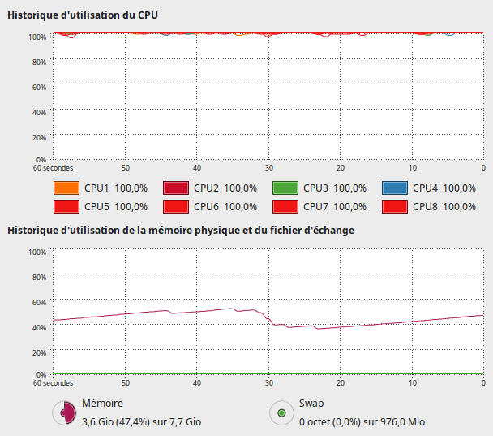
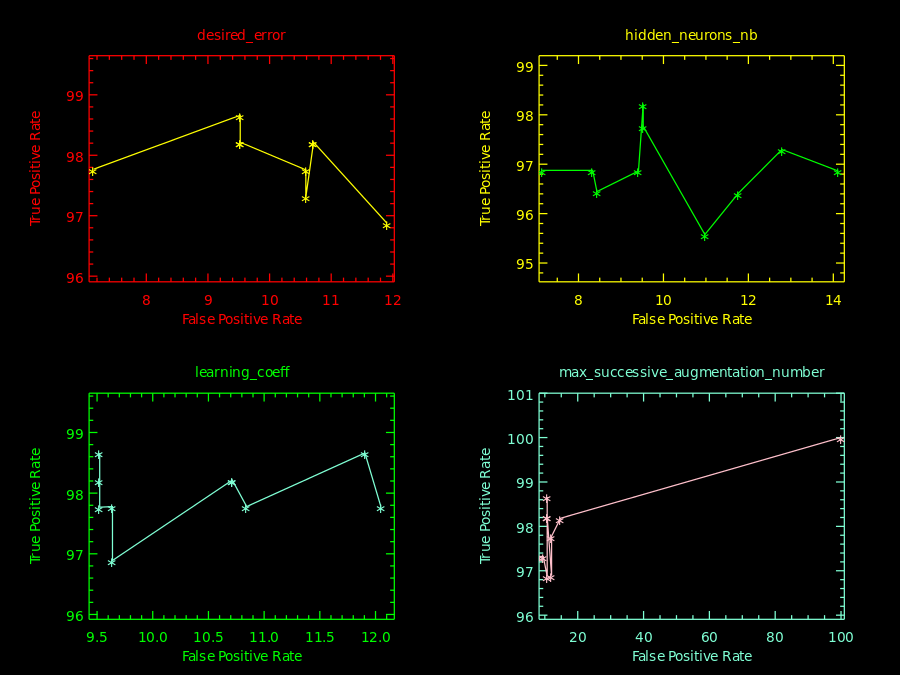
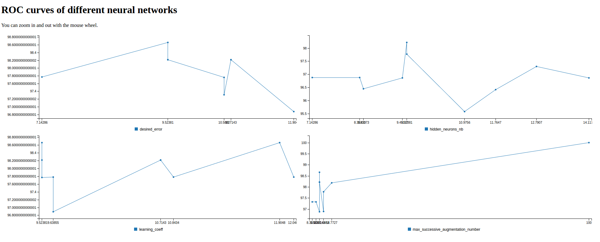
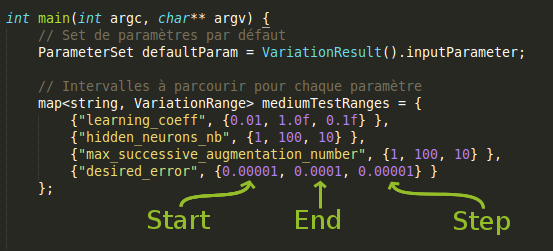
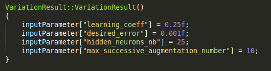
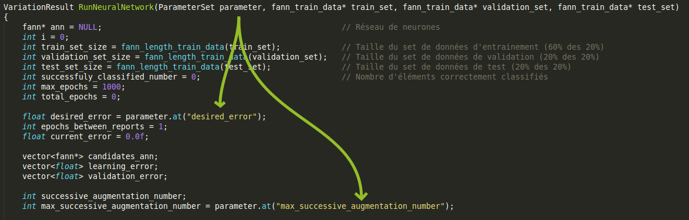

# neural-network
Authors : Slim BOUAOUINA - Thomas VILLE

The main goal of this project is to find the best parameters for a neural network which purpose is to detect malicious software.

## Features
 * Learns to detect malware based on n-gram analysis.
 * Takes only 20% of the given dataset to speed up the process.
 * Tries several NN parameters based on predefined ranges of values.
 * Creates an SVG image containing a ROC curve showing the efficiency of the NN for the different parameters.
 * Detects inconsistent parameters passed to the program.
 * Parallel processing of the test cases.
 * Pretty visualisation of the results with C3.js.

### Resource usage
In order not to fill up your computer's memory, only 8 tests are performed simultaneously.

### ROC curve
Here is an example of a ROC curve produced by the program :

If you have a python setup, you can also run `make view` in the main directory and go to the URL with a web browser to have a better view of each parameter.

## Dependencies
 * FANN >= 2.2
 * plplot
 * Python 2.7

## Documentation
### Makefile usage
The main commands you would like to use :
 - `build` : Builds the program
 - `run` : Builds and run the program
 - `view` : Launch the python webserver to view the results of an execution
 - `clean` : Deletes the .o files
 
### How to add a new test parameter
3 steps are required to add a new test parameter to the neural network :
1. main2.cpp
In the main function, set the range of values you want your parameter to iterate through.

2. VariationResult.cpp
In the default constructor of VariationResult, add a default value to the parameter.

3. RunNeuralNetwork.cpp
In RunNeuralNetwork, use your parameter the way you want, pass it to fann functions, switch on it, etc. Just remember that parameters are of float type.

